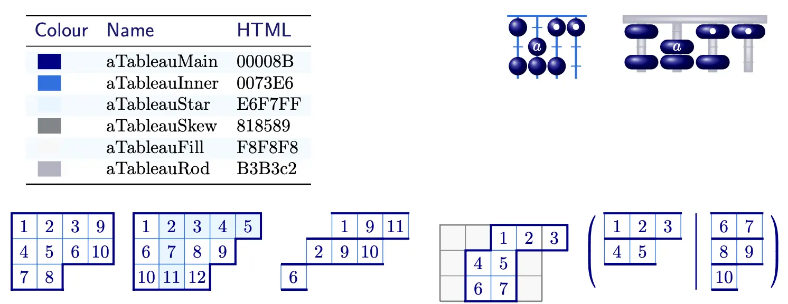

# aTableau

A LaTeX package for **symmetric group combinatorics**, with commands for:

- Abacuses
- Multitableaux
- Ribbon tableaux
- Shifted tableaux
- Skew tableaux
- Tableaux
- Tabloids
- Young diagrams



```latex
    \Abacus[styles={Y={text=pink}}]{4}{4_u,4_a,4_e,4_l,[Y]4_b,[Y]4_a,[Y]4_T,0_a}
    \Abacus[traditional]{4}{[bead=aTableauFill]2,0_a,[bead=aTableauFill]0|
        [bead=aTableauFill]1,1_b,1_a,1_T|1_u,1_a,1_e,1_l|[bead=aTableauFill]2^2,[bead=red]2}
    \Tableau{1239,456{10},78}
    \Tableau{ 1*2*3*4*5, 6*789, {10}*{11}{12} }
    \Tabloid[skew={2,1}]{19{11},29{10},6}
    \SkewTableau[skew~boxes, skew~border, cover=4^3] {2,1^2}{123,45,67}
    \Multitableau[tabloid]{ 123,45 | 67,89, {10}}
    \Tableau{12345,678,9{10},{11}}
    \Tabloid{1379{11},249{10},6,8}
    \Multidiagram[australian]{3,2^2|2,1,1|1}
    \Multitableau[box font=\tiny]{123,45,67|89,{10},{11}|{12}{13}{14}}
    \SkewTableau[russian]{3,2,1}{345,56,9{10}}
    \RibbonTableau[russian, skew={4,1^2}]{16rcrrrccrcc, 26, 34rc}
    \ShiftedTableau[skew boxes]{1*23,4*5}
    \SkewDiagram[skew border style={dashed,fill=red!10},skew border]{1^2}{2^3}
```

### Dependencies

[LaTeX3](https://www.latex-project.org/latex3/) and [TikZ](https://tikz.net/)

The **aTableau** package requires Tex Live 2024, or later, as it relies heavily on the LaTeX3 programming environment

## Author

Andrew Mathas <br>
&copy; 2022-2026

## Licence

LPPL Version 1.3c 2008-05-04

## Repository

[github.com/AndrewMathas/aTableau/](github.com/AndrewMathas/aTableau/)
