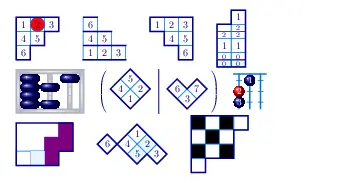

[](https://www.latex-project.org/lppl/)
[](https://ctan.org/pkg/atableau)


# aTableau

A LaTeX package for **symmetric group combinatorics**, with commands for:

- Abacuses
- Multitableaux
- Ribbon tableaux
- Shifted tableaux
- Skew tableaux
- Tableaux
- Tabloids
- Young diagrams
- Young walls




```latex
\Tableau{1[circle,fill=red]23,45,6} 
\Tabloid[french]{123,45,6} 
\ShiftedTableau{123,45,6} 
\YoungWall{*H0/0*H0/0,11,H2/2H~/2,1} 
\Abacus[traditional,framed]{3}{4^2,2,1^3,0}
\Multitableau[russian]{12,45|37,6} 
\Abacus{3}{4_3,[bead=red]2_2,1_1}
\RibbonTableau{(fill=Purple)14rcrc,*32c} 
\SkewTableau[australian]{2^2,1}{1*23,4*5,6}
\Diagram[colours={black,white}]{4,3,3,1}
```

<br clear="right">


### Dependencies

[LaTeX3](https://www.latex-project.org/latex3/) and [TikZ](https://tikz.net/)

The **aTableau** package requires Tex Live 2024, or later, as it relies heavily on the LaTeX3 programming environment

## Package files

The package consists of:

- atableau.ini - metadata for the package
- atableau.pdf - PDF file for the manual
- atableau.sty - package style file
- atableau.tex - the LaTeX source for manual
- atableau_beamer.pdf - image used in manual
- atableau_beamer.tex - latex source for image in manual
- atableau_readme.tex - latex source for image in README file
- atableau_readme.webp - image used in the README file
- DEPENDS.txt - LaTeX dependencies
- LICENSE - package licence
- README.md - github page README file
- CHANGES.md - change log
- TODO.md - todo list
- make_release - shell script that runs some sanity checks and then creates the ctan tar file
- manual_times - rough regression test giving times for each version to compile the manual
- compile_time - shell script for updating manual_times. Uses hyperfine
- tests/test_atableau.py - python script that checks for changes in the examples from the manual
- tests/atableau_example.cls - class file for testing examples from the manual


## Author

Andrew Mathas <br>
&copy; 2022-2026

## Licence

LPPL Version 1.3c 2008-05-04

## Repository

[github.com/AndrewMathas/aTableau/](github.com/AndrewMathas/aTableau/)
